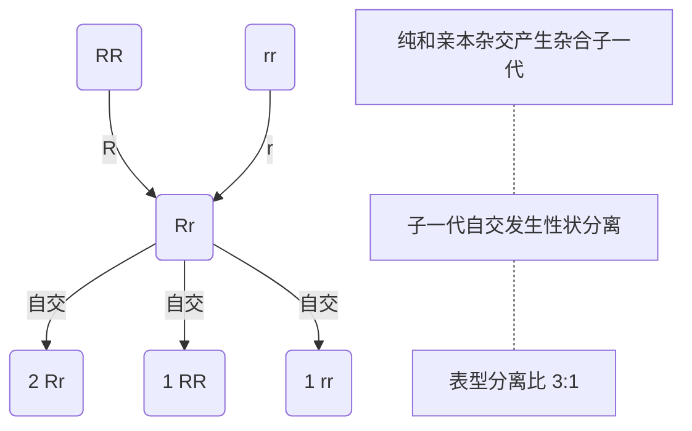
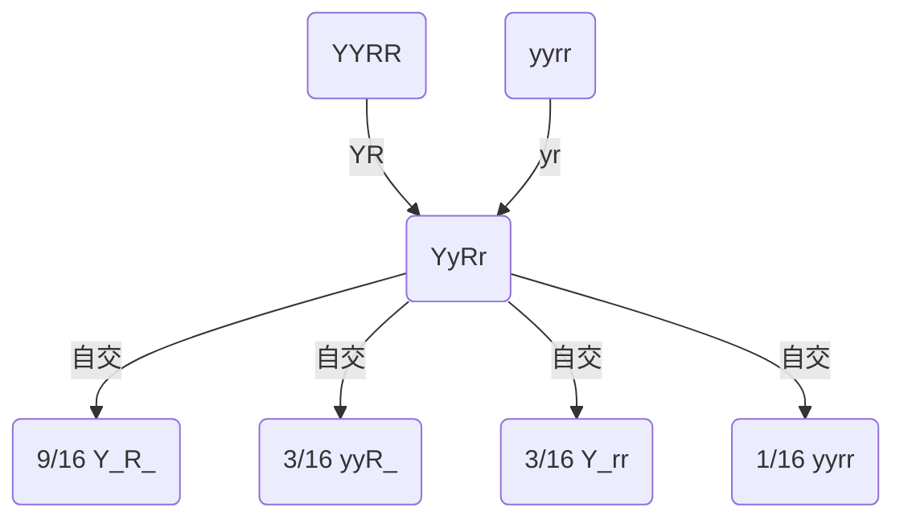

# 普通生物学复习笔记

点击[这儿](#复习计划)进行复习规划。

[TOC]
# 绪论

1. 生物圈（ biosphere ）：地球上所有生态系统的总和，由生物和它所居住的环境共同组成，也是最大的生态系统。

2. 稳态（ homeostasis ）：指生物通过许多调节机制，保持内部条件相对稳定的状况，也称内稳态。维持内环境稳定的主要调节机制是反馈。

3. 应激性（ irritability ）：生物感受外界刺激并做出有利于保持其体内稳态，维持生命活动的应答反应。应激性是生物的普遍特性。

   > 应激性分为两个过程，一是感受刺激，二是对刺激做出反应。动物的感觉器官与运动器官是应激性高度发展的产物。
   >
   > 草履虫的简单应激性到眼虫的感受再逐步发展成为动物的感受器官。

4. 适应：包含两方面的涵义，生物的结构都适合于一定的功能；生物的结构和功能适合于该生物在一定环境条件下的生存和延续。适应是生物界普遍存在的现象。

   > 多肉植物的结构和功能相适应，结构功能和环境相适应。
   >
   > 有一个xxx的结构，因此具有xxx的功能，这样的结构和功能是为了适应xxx的环境。

5. 生物的多层次组构：原子—分子—生物分子生物大分子—细胞器——细胞——组织——器官——系统——个体——种群——群落——生态系统。

   - 从生物的多层次结构可以认识到生命产生的过程：先是有机小分子的非生物产生→有机大分子的非生物产生→形成生物合成体系→原始细胞的形成

6. 五界分类系统：惠特克（R. H. Whittaker）根据细胞结构和营养类型将生物分为五界，即原核生物界（Monera）、原生生物界（Protista）植物界（Plantae）、真菌界（Fungi）和动物界（ Animalia）。

   > 在生物学历史上曾经有多种分类系统：
   >
   > - 二界分类系统：动物界和植物界
   > - 三界分类系统：动物界、植物界、原生生物界
   > - 四界分类法：动物界、植物界、原生生物界、原核生物界

7. 三域分类学说：伍斯和福克斯根据核糖体亚基的 16S rRNA、18S rRNA 序列分析，把生物界分成真细菌域（Bacteria）、古核生物域（古细菌域）（ Archaea）、真核生物域（Eukarya）三个域，又称三原界学说。

   > 在三域学说中，古核生物（古细菌）域与真核生物域在发育树上相距更近。虽然古细菌在结构上与真细菌更相似，但是在进化上，与真核生物更接近。

8. 双名法（ binomial nomenclature ）：林奈创立的为物种命名的方法，由拉丁化的属名和种名联合构成。

## 习题补充

1. 生命的特征包括：

   1. 特定的组构
2. 新陈代谢
   
   - 代谢分解
      - 代谢合成
   3. 稳态和应激性

      - 内稳态
   - 反馈调节机制
   4. 生殖和遗传
   1. 遗传是指亲代和子代之间在形态结构、生理机能上的相似。
   2. 变异是指亲代和子代，子代和子代之间不会完全相似。
   5. 生长和发育
6. 进化和适应
      1. 进化是指群体或者物种在连续的世代中发生遗传改变和相关表型的变化。
   2. 适应是生物的形态结构总是适合在某一特定的环境下生存。这是生命特有的现象。
2. 生命的同一性体现在 化学成分、 遗传物质、遗传密码、 信息流（中心法则）、新陈代谢等方面。
3. 科研的结果必须有可重复性。（检验）
4. 常用研究方法有：科学考察、假说、实验、模型试验。
   1. 科学观察：从客观世界中获取第一手资料
   2. 假说和实验：假说是指：；实验是指将实验对象在人为干预、人为控制的条件下进行观察，称为实验。
5. 分类单位：界门纲目科属种。

# 生命的化学基础

1. 必需元素（ essential element ）：在生物的生活中，不可代替的不可缺少的元素。

   自然界元素92中，生命必须元素 25 种，11 种大量元素，14 种微量元素。

   碳氢氧氮磷硫钾钙镁氯钠，铁锰硼锌钡硅矾钴铜锌钼

2. 同位素示踪：是利用放射性核素作为示踪剂对研究对象进行标记的微量分析技术。

3. 生物大分子（ macromolecule ）：在生命现象中起重要作用的分子都是极其巨大的，可分为蛋白质、核酸、多糖和脂质四大类。

4. 多聚体（ polymer）：由相同或相似的小分子组成的长链。组成多聚体的小分子成为单体。蛋白质、核酸、多糖都是多聚体。

   > 大分子不都是多聚体，多聚体一定是大分子

5. 糖类：是指含有多羟基的醛类或酮类化合物，其产生的缩聚物或衍生物。

   1. 单糖：葡萄糖和果糖
   2. 双糖：蔗糖、麦芽糖
   3. 多糖：纤维素、淀粉、糖原

6. 氨基酸（ amino acid ）：含氨基和羧基的化合物，是蛋白质的结构单体

7. 肽键（ peptide bond ）：一个氨基酸分子中的氨基与另一氨基酸分子中的羧基脱水缩合形成的共价酰胺键（-NH-CO-）。

8. 肽（ peptide ）和多肽（ polypeptide ）：不同数目的氨基酸以肽键顺序相连，形成链状分子，即是肽或多肽，通常分子量在1500以下的为肽，在1500以上的为多肽。

9. 蛋白质的一级结构：多肽链中氨基酸的排列顺序。

10. 蛋白质的二级结构：是指蛋白质分子中的肽链向单一方向卷曲而形成的有周期性重复的主体结构或构象。这种周期性的结构是以肽链内或各肽链间的氢键来维持的。包括α-螺旋、β-折叠、β-转角、无规卷曲。

11. 蛋白质的三级结构：在二级结构基础上的肽链再折叠形成的构象是三级结构，如球蛋白、纤维蛋白。

12. 蛋白质的四级结构：有两条或多条肽链折叠，弱键互相连接形成的构象。

13. 蛋白质的变性（ denaturation ）：在化学、物理因素等作用下，蛋白质天然空间结构发生改变和破坏从而失去生物学活性的现象。

14. 核苷酸：核酸的结构单体。每一核苷酸分子含有一个戊糖（核糖或脱氧核糖）分子、一个磷酸分子和一个含氮的有机碱（含氮碱基）。

15. DNA双螺旋（ double helix）： Watson和 Crick 提出DNA的双螺旋结构，是两条脱氧核糖核苷酸长链以碱基配对相连而成的多聚物。

## 笔记补充

1. 生物元素的作用：构成生物体，传递生物系信息，保持生物体内的水盐平衡，参与酶的构成、调节酶的活性。

2. 蛋白质的分类：
   1. 结构
   2. 收缩
   3. 贮藏
   4. 防御
   5. 转运
   6. 信号
   7. 酶
3. 脂质：由C和H两种元素以非极性共价键相连接。在其分子中不饱和度脂肪酸越高，流动性越好，凝固点越低。（猪油黄油等动物油脂和菜籽油橄榄油等植物油脂的比较）磷脂，胆固醇，蜡。

## 习题补充

1. 骨质疏松是由于骨骼内无机物增多引起的。
2. 胆固醇不是构成植物细胞膜的结构成分之一。
3. DNA的三级结构：沃森和克里克发现的双螺旋结构（ B-DNA ）是三级结构的主要形式，但还包含 Z-DNA 和 A-DNA 等其他双螺旋结构和三联体、四联体等特殊结构。
4. 在活细胞或者活的生物体中占比最大的化学成分是 H~2~O 。
5. 染色体被[吉姆萨染料](https://zh.wikipedia.org/wiki/吉姆萨染液)染色后相似的[G带](https://zh.wikipedia.org/wiki/G显带)是富含A-T核苷酸的区段.
6. 两性分子在水或盐水中在其等电点的溶解度最低，一般会在等电点时从溶液里沉淀出来。等电点与[双向凝胶电泳](https://zh.wikipedia.org/wiki/双向凝胶电泳)密切相关。当分子在低于其等电点的溶液中进行自由界面电泳时，分子向负极运动。


# 细胞结构和细胞通讯

1. 细胞学说：施莱登和施万提出细胞学说，指出所有的植物和动物都是由细胞构成的；新细胞只能由原来的细胞经分裂而产生。

   - 所有的生物都由细胞以及细胞产物构成
   - 细胞是生物体结构和功能的基本单位，所有的细胞都有基本相同的换血珠峰和代谢活性
   - 新的细胞只能由原来的细胞分裂产生

   > 意义：它的建立使动植物有机统一，从哲学论断走向科学论证，奠定了生物科学的基础。

2. 细胞质（ cytoplasm ）：指除细胞核以外的所有部分，质膜是细胞质的最外层。

3. 生物膜（ biomembrane ）：细胞膜及细胞的内膜系统，统称为生物膜。厚7～8 nm，具有选择透性。

4. 核被膜（ nuclear envelope ）：包在核的外面，由两层膜组成，两膜之间为核周腔。在多种细胞中，外膜延伸与细胞质中糙面内质网相连，核被膜内面有纤维状蛋白组成的核纤层。核膜上有小孔，称核孔（ nuclear pores ），与**核纤层**紧密结合，成为**核孔复合体**。

5. 核纤层（ nuclear lamina）：核被膜内面由纤维状蛋白构成的一层网络结构，对核被膜起支撑作用。组成核纤层的纤维状蛋白是**核纤层蛋白**。

6. 染色质（ chromatin ）：真核细胞间期核中能被碱性染料染色的物质，主要由**DNA**和**蛋白质**组成的线状复合物。

7. 常染色质（ euchromatin ）：间期核中折叠压缩程度低，处于伸展状态，用碱性染料染色时着色浅的那些染色质。呈细丝状。一般而言，常染色质是**转录活性区**，是基因区。

8. 异染色质（ heterochromatin ）：在有丝分裂完成之后，约有10％的染色质在整个间期仍然保持压缩状态，这种染色质称为异染色质。与常染色质相比，异染色质是转录不活跃部分。

9. 染色体（ chromosome ）：细胞在有丝分裂和减数分裂过程中由染色质聚缩而成光学显微镜下可看见的棒状结构。染色体和染色质在化学本质上没有差异，是遗传物质在细胞周期不同阶段的不同表现形式。

10. 组蛋白（histone ）：真核生物染色体的基本结构蛋白，是一类小分子碱性蛋白质，富含带正电荷的碱性氨基酸，能与DNA中带负电荷的磷酸基团结合。有五种类型：H1、H2A、H2B、H3、H4，它们由不同的基因编码。

11. 核仁组织者（ nucleolus organizer ）：编码核糖体RNA的rDNA区域。

    > 核仁是在核仁组织者周围富含RNA和蛋白质的区域。

12. 高尔基复合体（ Golgi complex ）：又称高尔基体（ Golgi apparatus ），意大利科学家 Camillo Golgi 在 1898 年发现，普遍存在于真核细胞中。由一系列扁平膜囊和小泡组成，与细胞的分泌功能有关，是蛋白质加工、贮存、分拣和转运的中心，还具有合成多糖的功能。

13. 质体（ plastid ）：植物细胞中由双层膜包裹的一类细胞器的总称，由前质体分化发育而来，分白色体和有色体两类。最主要的有色体是叶绿体，具有一定的自主性，含有 DNA 、RNA 、核糖体等，进行光合作用。

14. 液泡（ vacuole ）：在细胞质中由单层膜包被的充满稀溶液的囊泡，存在于植物、动物和原生生物的细胞中，各有其特有功能。

15. 内质网（ endoplasmic reticulum，ER ）：是细胞质中以膜为基础形成的囊状、泡状和管状结构，分为光面内质网和糙面内质网两种。

16. 细胞骨架（ cytoskeleton ）：是一种贯穿在整个细胞质中的网状结构，由3类蛋白质纤维构成：微管、微丝和中间丝（中间纤维）。

17. 细胞连接（ cell junctions）：细胞膜在相邻细胞之间分化而成特定的连接，即细胞连接。

    - 紧密连接
    - 间隙连接
    - 桥粒
    - 孢间连丝

18. 细胞通讯：是指细胞通过胞膜或胞内受体感受信息分子的刺激，经细胞内信号转导系统转换，从而影响细胞生物学功能的过程。化学信号转导途径包括3个阶段：信号接受、信号转导和细胞对信号的响应。

    1. 信号接受：信号分子都是一个配体[^1]。它与受体结合以后往往会使受体分子发生形状上的改变，受体分子往往是质膜中的蛋白质。

       常见的受体是 G 蛋白偶联受体。

    2. 信号转导途径：信号转导途径的作用是把信号从受体上传递到细胞内发生专一响应。信号转导只是信号的传递，每一次传递大多都伴随着由磷酸化引起的蛋白质构象的改变。在信号传导的过程中还有一些小分子起作用，称之为第二信使[^第二信使]，化学本质往往是Ca^2+^和环 AMP[^cAMP]。

       常见的磷酸化的酶是蛋白激酶。反作用酶是蛋白磷酸酶。

    3. 细胞响应：信号的传导的最终结果是细胞对信号的响应。

    信号传导过程的存在是利用**联级反应**放大信号。


## 笔记补充

1. 植物细胞壁的结构

   1. 胞间层：（中胶层）主要成分是果胶，形成时间是新细胞形成时。
   2. 初生壁：主要成分是纤维素，半纤维素和果胶质，形成时间是在细胞生长过程中。
   3. 次生壁：主要成分是纤维素和半纤维素，形成时间是细胞结束生长以后。

2. 原核细胞和真核细胞的区别

   |        | 原核细胞                                                     | 真核细胞                                                     |
   | ------ | ------------------------------------------------------------ | ------------------------------------------------------------ |
   | 细胞核 | 无膜包被的细胞核，只有一个拟核区，是一个大型环状DNA分子。在细胞中还分散着多个质粒。 | 具有膜包被的细胞核，细胞内的遗传物质是由DNA和组蛋白构成的染色质。细胞中的遗传物质除了存在于细胞核中还存在于细胞内的线粒体和叶绿体中。 |
   | 细胞器 | 除核糖体外，无其他细胞器。同时因为结构简单，细胞大小小，不需要细胞骨架。 | 具有多种细胞器以及细胞骨架                                   |

   

3. 真核细胞器结构功能的总结

| 名称     | 作用                                                         | 其他                                                         |
| -------- | ------------------------------------------------------------ | ------------------------------------------------------------ |
| 细胞核   | 是真核细胞的控制中心。包括核被膜、染色质、核仁和核基质等部分 | 构成核孔的蛋白是核孔蛋白。核被膜外膜实际上是内质网，内面有核纤层，组成核纤层的纤维蛋白称为核纤层蛋白。染色质中的组蛋白是碱性蛋白。核小体是由H2A, H2B, H3, H4四种蛋白和围绕他们的DNA长链构成。 |
| 核糖体   | 核糖体是由rRNA和蛋白质组成的颗粒,是进行蛋白质合成的细胞器。每个核糖体均由大、小2个亚基组成。大亚基上有两个 tRNA 连接部位 P 位和 A 位。关于核糖体在翻译中的作用请见[这里](####中心法则)。 | 有两种存在形式：附着在内质网上（糙面内质网），游离于细胞溶胶中。 |
| 内质网   | 内质网是由膜组成的网。ER由膜形成的小管与小囊状的潴泡( cIsterna)组成,ER膜把这些潴泡与细胞溶胶分隔开。 | 糙面内质网和光面内质网两者相互连通，但是结构和功能上不同。核被膜与ER相连。光面内质网有合成脂质，糖类的代谢，药物或者毒物的解毒（降解）等功能。糙面内质网合成分泌蛋白并产生膜 |
| 高尔基体 | 我们可以把高尔基体看做是细胞中蛋白质的加工、贮存、分拣和转运的中心。ER的产物在此被加工和存贮然后分送到各自的目的地。在起分泌作用的细胞中高尔基体特别发达。典型的高尔基体在电镜照片上由一摞扁平的小囊和小泡组成。每个扁平小囊常称为一个潴泡( cisterna)。 | 高尔基体具有极性，有接收侧（顺面）和外送侧（反面）的区别。还有合成多糖的功能（植物的果胶物质和非纤维素多糖）。 |
| 溶酶体   | 单层膜包被。多种酸性条件下的水解酶类。由高尔基体外运侧出芽形成。 | 含60种以上的酶，最适pH在5左右。                              |
| 液泡     | 单层膜包被的充满稀溶液的囊泡。植物细胞种液泡中的液体称之为细胞液。 | 有贮藏功能，消化功能，维持内环境和维持植物抗性。             |
| 线粒体   | 能量转换细胞器。不是内膜系统的一部分，属于半自主细胞器。线粒体的结构相当复杂。 | 线粒体的结构相当复杂。它是由内外两层膜包被的囊状细胞器(图3.12),囊内充有液态的基质(matix),内外两层膜之间有腔。外膜平整无折叠,内膜向内折叠而形成突出于基质中的嵴( crista),嵴使内膜的表面积大为增加,有利于生化反应的进行。线粒体基质中还有DNA分子和核糖体 |
| 叶绿体   | 能量转换细胞器。不是内膜系统的一部分，属于半自主细胞器。细胞的动力工厂。 | 叶绿体的外被是双层膜。叶绿体内部是一个悬浮在基质之中的复杂的膜系统。基质是电子密度较低的物质,膜系统则由一摞扁平的囊（类囊体）组成。大部分类囊体有规律地叠在一起称为基粒。光合作用的色素和电子传递体都位于类囊体膜中,因此也称为光合膜,各基粒之间还有埋在基质之中的基质类囊体,与基粒类囊体相连,两种类囊体的腔是彼此连通的。 |
| 质体     | 分为白色体和有色体，最主要的有色就是叶绿素。白色体常用于贮藏物质（淀粉、油脂）。有色体含有色素，呈现颜色和进行光合作用。 | 常见色素有类胡萝卜素和叶绿素 |
| 微体 |氧化分解|分为过氧化为酶体和乙醇酸循环体（只在植物中，将脂肪直接转化为糖）。|
|细胞骨架|维持细胞的基本形态和组织细胞活动|由三类蛋白质纤维组成：微管、微丝、中间丝。|
|鞭毛、纤毛和中心粒| 鞭毛纤毛负责细胞的运动，区别在于运动的方式、数目和长度不同。中性粒存在动物细胞和低等植物细胞中，埋藏在特殊的细胞质中心体中。与细胞分裂有关| |

4. 流动镶嵌模型
   - **流动**。磷脂分子间靠疏水键连接在一起形成了膜。疏水相互作用要比共价键弱很多，因此磷脂分子能在膜上侧向移动，而膜蛋白也会在胞质侧的马达蛋白作用下移动。膜的流动性与温度有关，同时膜中的不饱和脂肪酸的数量也会影响膜的流动性（温度高时阻碍膜的流动，温度低的时候促进膜的流动）。
   - **镶嵌**。膜蛋白镶嵌在磷脂双分子层中。膜内在蛋白，膜周边蛋白。
   - **识别**。膜表面有一层糖萼。糖萼是由寡糖链和蛋白质共同构成的。糖蛋白在细胞膜外层起到信号识别的作用。糖萼中带有负电荷的唾液酸，在金属染料的染色后，在电子显微镜下表现为电子密度很高的一条粗线。

## 习题补充

1. 生物膜的脂类分子靠**疏水键**连接在一起。

# 细胞代谢

1. 代谢（ metabolism ）：生物体内发生的所有有序化学反应的总称。

2. ATP（ adenosine triphosphate ）：**腺苷三磷酸**，腺苷一磷酸（AMP）的磷酸一侧，以**高能磷酸键**（用～表示）再顺序连接上2个磷酸。ATP水解时，高能磷酸键断裂释放大量自由能，供生命活动所需；ATP在细胞中易于再生，是细胞中的“能量通货”。

3. 酶（ enzyme ）：一种生物催化剂，化学本质多是蛋白质，能降低反应的活化能，加速生物体内化学反应的进行。

   > 酶的活性与多种因素有关：温度，pH，盐浓度，辅因子，抑制剂等。

4. 酶的活性部位（ active site ）：酶分子表面具有一些凹沟结构，是酶分子与底物分子锲合形成复合物的位点。

   > 活性部位决定了酶的专一性，限制了酶只能结合一种或一类底物。

5. 核酶（ ribozyme ）：具有催化活性的RNA，前发现的至少有两类：一类催化分子内部的反应，另一类催化分子间的反应。

   > 核酶的发现提出一种生命诞生可能， RNA先出现，并催化了蛋白质的产生。

6. 竞争性抑制剂（ competitive inhibitor ）：与酶的作用底物相似，能与底物竞争结合酶的活性位点，这种化学试剂称为酶的竞争性抑制剂。

7. 非竞争性抑制剂（ noncompetitive inhibitor ）：与酶的活性位点以外的部位结合，使酶分子形状发生了变化，活性位点不适于接纳底物分子的化学试剂。

8. 质壁分离（ plasmolysis ）：当外界溶液浓度大于细胞液浓度时，水由细胞中渗透出去，原生质体缩水而与细胞壁脱离的现象。

9. 单纯扩散（ simple diffusion ）：不需要膜中蛋白质等分子的协助，也不需要细胞提供能量的扩散。(被动转运)

10. 易化扩散（ facilitated diffusion，协助扩散）：物质顺浓度梯度，与质膜转运蛋白结合而不需要能量的扩散。通道蛋白或者载体蛋白。

11. 被动转运（ passive transport）：物质**顺浓度梯度**穿过膜扩散的作用，是物质出入细胞中常见的现象。不仅是顺物质浓度梯度，同时还顺电化学势梯度

12. 主动转运（active transport ）：在细胞膜特异载体蛋白携带下，**消耗能量**、物质逆浓度梯度的跨膜运输方式。

13. 胞吐（ exocytosis ）：细胞通过高尔基体出芽形成的分泌小泡，沿细胞骨架移动到质膜，并与质膜融合排出小泡内物质的现象。

14. 胞吞（endocytosis ）：细胞吸收大分子和大颗粒的方式，由质膜形成内向的小泡完成。包括三种类型：吞噬、胞饮和受体介导的胞吞。

15. 吞噬作用和胞饮作用：细胞吞噬固体颗粒的作用成为吞噬作用（ phagoeytosis）。除固体颗粒外，多种细胞还能吞入液体和直径小于0. 2μm的生物大分子的过程，为胞饮作用（ pirocytosis ）。

16. 受体介导的胞吞：通过膜中的受体蛋白专一性地与胞外配体结合，并吞入细胞的现象。17. 细胞呼吸（ cellular respiration）：细胞在有氧条件下从食物分子中取得能量的过程。

17. 细胞呼吸（ cellular respiration ）：细胞在有氧条件下从食物分子中取得能量的过程。

18. 电子传递链（ electron transport chain ）：线粒体内膜上一组酶的复合体，其功能是进行电子传递H^＋^的传递及氧的利用，产生H~2~O和ATP，又称呼吸链（respiratory chain）

19. 氧化磷酸化（ oxidative phosphorylation ）：呼吸链上释放的能量与腺苷二磷酸ADP以及无机磷酸偶联形成腺苷三磷酸ATP的过程。是需氧生物获得能量的主要方式。

20. 化学渗透假说（ chemiosmotic coupling hypothesis ）：英国生物化学家 Mitchell于1961年提出，解释氧化磷酸化的偶联机理。该学说认为：在电子传递过程中，伴随着质子从线粒体内膜的内侧向外侧转移，形成跨膜的氢离子梯度，这种势能驱动氧化磷酸化反应，用于合成ATP。化学渗透学说可以很好地说明线粒体内膜中电子传递、质子动势的建立、ADP磷酸化的关系。

21. 光合作用（ photosynthesis）：通常是指绿色植物吸收光能，把二氧化碳和水合成有机物，同时释放气的过程。从广义上讲，光合作用是自养生物利用光能把二氧化碳合成有机物的过程。

22. 光反应（light reaction ）：光合作用中需要光的反应。为发生在类囊体上的光的吸收、传递与转换电子传递和光合磷酸化等反应的总称。

23. 希尔反应（ Hill reaction ）：希尔（R. ill）发现在分离的叶绿体（实际是被膜破裂的叶绿体）悬浮液加入适当的电子受体，照光时可使水分解而释放氧气。

24. 光合膜（ photosynthetic membrane ）：组成叶绿体类囊体的膜，光合作用光反应进行的场所。叶绿素、其它色素、将光能转变为化学能的整套蛋白质复合体存在其上

25. 反应中心色素分子（ reaction center pigment ）：是处于反应中心中的一种特殊性质的叶绿素a分子，它不仅能捕获光能，还具有光化学活性，能将光能转换成电能。

26. 光系统（ photosystem ）：进行光吸收的功能单位，是由叶绿素、类胡萝卜素、蛋白质和光合作用的原初电子受体组成的复合物。

27. 光合电子传递链（ photosynthetic electron transfer chain）：光合膜上的一系列电子载体，将来自于水的电子传递给NADP^＋^

28. 光合磷酸化（ photophosphorylation）：光合电子传递链运行过程中发生的由ADP与Pi合成ATP的反应。

29. 解偶联剂（ uncoupler）：能消除类囊体膜或线粒体内膜内外质子梯度，解除磷酸化反应与电子传递之间偶联的试剂。

30. 碳反应（ carbon reaction）：光合作用中的酶促反应，即发生在叶绿体基质中的同化CO~2~反应。

    |      |光反应 | 暗反应 |
    | :---:|:---: | :---: |
    | 能量转换 | 光能转化为活跃的化学能 | 活跃的化学能转化为稳定的化学能 |
    | 过程 | 光能吸收传递、电子传递、光合磷酸化 | 碳同化 |
    | 发生部位和条件 |叶绿体类囊体膜上，需要光|叶绿体基质，不需要光|
    | 储能物质（产物） |ATP 、NADPH|糖类等|

31. C3途径（C3 pathway）和C3植物（C33 plant）：3途径又称卡尔文循环。整个循环由RuBP开始至RuBP再生结束，在叶绿体的基质中进行。全过程分为羧化、还原、再生3个阶段。由于这条光合碳同化途径中CO~2~固定后形成的最初产物3-磷酸甘油酸（PGA）为三碳化合物，所以称C3途径，并把只具有C3途径的植物称为C3植物。C3植物大多为温带和寒带植物。水稻、小麦、棉花、大豆、油菜等为C3植物。

32. C4 途径（C4 pathway）和C4植物 ( C4 plant )：光合碳同化途径中CO~2~固定后形成的最初产物草酰乙酸（OAA）为四碳化合物，整个循环由PEP开始至PEP再生结束，经叶肉细胞和维管束鞘细胞两种细胞，可分为羧化还原或转氨、脱羧和底物再生四个阶段，所以叫做C4途径，把具有C4途径的植物称为C4植物C4植物大多为热带和亚热带植物，如玉米、梁、甘蔗、稗草、苋菜等。

    

    

    |               | C3途径                         | C4 途径                                                      |
    | :-----------: | ------------------------------ | ------------------------------------------------------------ |
    | 叶片解剖结构  | 维管束鞘细胞与叶肉细胞排列疏松 | 维管束鞘细胞与叶肉细胞排列紧密，有叶绿体，富含孢间连丝，维管束发达 |
    |    叶绿体     | 只有叶肉细胞含有叶绿体         | 维管束鞘细胞中叶绿体基粒片层不发达，叶绿体体积比叶肉细胞中的大 |
    | CO~2~同化途径 | 只有C3途径                     | C3、C4均有                                                   |
    |   CO~2~受体   | RuBP                           | RuBP和PEP                                                    |
    |   最初产物    | 3-磷酸甘油酸                   | 草酰乙酸                                                     |
    |    光呼吸     | 高                             | 低                                                           |
    |  净光合速率   | 低                             | 高                                                           |

    

    > C3植物和C4植物除了上表列出的不同以外，还有酶的不同。C3固定CO~2~的酶是**核酮糖二磷酸羧化酶**，而C4固定CO~2~的酶是**磷酸烯醇式丙酮酸羧化酶**，后者相较前者对CO~2~的亲和度更高，能在CO~2~浓度低的时候与之结合。
    >
    > 景天酸代谢植物则服从以下昼夜节律：
    >
    > - 晚上：二氧化碳吸收和固定于磷酸烯醇式丙酮酸（PEP）。生成的草酰乙酸（OAA）会被还原为苹果酸，并储存于细胞的液泡中。该过程中伴随有酸化，pH值降低在日间光反应里产生的还原物质也会在这里发挥作用。
    > - 日间：在液泡里的酸性物质（主要是苹果酸，但也有天门冬氨酸）会被脱羧。释放的二氧化碳进入卡尔文循环。
    >
    > 景天酸代谢植物必须准备足够的磷酸烯醇式丙酮酸以供夜间二氧化碳固定使用。为此植物在日间储存淀粉，晚间它们将通过丙酮酸转变为磷酸烯醇式丙酮酸。这种光合作用类型的缺点是比较耗能

33. 光呼吸（ photorespiration）：高等植物在干旱炎热的环境中，气孔关闭，阻止CO~2~的进入和O~2~的逸出，绿色细胞在光下吸收O~2~释放CO~2~的过程。在细胞过氧化物酶体中进行。

## 待补充

1. 磷酸化的类型

   磷酸化是指在蛋白质或者其他分子上加入一个磷酸基团。

   1. 氧化磷酸化：线粒体中的的电子传递链或者原核生物的细胞膜
   2. 光合磷酸化：叶绿体类囊体膜上
      1. 底物水平磷酸化：是指一类ADP或其他核苷二磷酸的磷酸化作用与底物的脱氢作用直接相偶联的反应过程。发生在糖酵解反应和三羧酸循环中。																																								

有氧呼吸和无氧呼吸的联系和区别

## 笔记补充

1. 热力学定律：能量守恒定律，熵增焓减
2. 生命的有序性增加必然使宇宙的无序性增加
3. 吸能反应和放能反应。→ 光合作用和细胞呼吸
4. 渗透现象是集流和扩散的结果

### 细胞呼吸

#### 引论

1. 细胞呼吸通式是

   C~6~H~12~O~6~ + 6O~2~ ——→ 6CO~2~+ 6H~2~O + 能量 

   其本质是受控制的氧化还原反应。

2. 细胞呼吸是分为许多个化学反应由专一的酶催化，这样就可以实现对反应的精密调控。总的来说分为三个阶段：糖酵解、柠檬酸循环和电子传递链。

#### 糖酵解

1. 葡萄糖的分解产生丙酮酸的过程

2. C~6~H~12~O~6~ + 2 ADP + 2 Pi + 2 NAD^+^ ——→  2 CH~3~COCOOH + 2 ATP + 2 NADH + H^+^

3. 糖酵解总共分九个反应。前四个反应将己糖转化为两个丙糖，后五个反应将丙糖转化为丙酮酸。

   

实际上前四个反应常被称为准备阶段，常常需要消耗能源（2 ATP）；后五个阶段被称为放能阶段产生能源（4 ATP）.糖酵解阶段直接产生的能量只占葡萄糖总能量的 5%，而其产生的 NADH 中的能量占细胞能从葡萄糖中获取能量的 16%，但这部分能量只能在有氧条件下才能被利用。

#### 柠檬酸循环

1. 糖酵解产生的丙酮酸不能直接参与柠檬酸循环，需要先转化为乙酰CoA[^乙酰CoA]才能参与柠檬酸循环。

   > CH~3~COCOOH + NAD^+^ + CoA·SH ——→  
   >
   > ​									CH~3~CO·S·CoA + CO~2~ + NADH + H^+^

2.  乙酰CoA 在柠檬酸循环中被氧化，产生两分子CO~2~ 和 NADH 和 FADH2。

   > CH~3~CO·CoA + 3NAD^+^ + FAD + ADP + Pi →
   >
   > ​			 CoA·SH + 2CO~2~ + 3NADH + 3H^+^ + FADH~2~ + ATP

3. 每一分子乙酰CoA进行一轮柠檬酸循环，总共产生 一分子 ATP、三分子 NADH 和一分子 FADH~2~。而每一分子葡萄糖经过糖酵解在柠檬酸循环前产生两分子乙酰 CoA。

   

#### 电子传递链和氧化磷酸化

1. 在糖酵解和柠檬酸循环中产生了大量的 NADH 和 FADH~2~ 这两种还原型高能化合物在线粒体内膜上由电子载体组成的电子传递链中被氧化还原。这些电子载体传递电子的算徐是严格的，每一次传递都可以视作一次氧化还原反应。最后一个被还原的电子载体将电子传递给O~2~ 。

   

2. 化学渗透假说：ATP合酶催化 ATP 形成的机制。

   化学渗透假说认为在发生电子传递时释放出的能量，使传递链中的蛋白质复合体将质子由内膜的内侧通过主动转运到达外侧，造成膜两侧的质子浓度梯度，外侧的质子浓度高而内侧的浓度低。这样就造成了一个跨膜的质子浓度梯度。这样的一种势能就能够被 ATP 合酶用于合成 ATP 。

3. 底物磷酸化机制：底物水平磷酸化的实质是酶将一种底物上的磷酸基团转移给 ADP。

   > 发生的原因是原来的底物结合磷酸基团的键相较于高能磷酸键更不稳定。

#### 发酵

无氧呼吸，产生酒精或乳酸。

#### 小结

一分子葡萄糖经过有氧呼吸总共产生 30 或者 32 个 ATP。

1. 糖酵解反应产生两个 ATP 和两个 NADH
2. 柠檬酸循环一次产生四个 NADH 和 一个 FADH~2~ ，并生成一个 ATP。两个丙酮酸生成两个乙酰辅酶 A ，进行两次柠檬酸循环。
3. 在电子传递链中，每个 NADH 最多可产生 2.5 个 ATP ，每个 FADH~2~  最多可产生 2 个 ATP 。总共传入十个 NADH 和 两个 FADH~2~ 。产生 ATP 

### 光合作用

#### 引论

光合作用利用空气中的CO~2~和土壤中的水合成有机物。能量来源是太阳。释放出的氧气来自于水，其总反应方程式为

> CO~2~ + 2H~2~O^*^ ——→ (CH~2~O) + H~2~O + O~2~^*^

**概述**：光合作用是地球上最重要的化学过程。能够为地球上的绝大多数生物提供食物。光合作用相关的细胞器是叶绿体（植物和藻类细胞).其化学本质是氧化还原过程，呼吸作用是将糖氧化成为CO~2~ ，而光合作用相反，是将CO~2~还原为糖，将H~2~O氧化为氧气。观和反应是一个吸能反应，它需要光能才能使反应进行。光合作用分为两个阶段，一是光反应，主要是将光能转化为化学能并产生氧气，另一个阶段是暗反应（碳反应）——卡尔文循环，主要是将活跃的化学能转化为稳定的化学能。

#### 光反应

1. 叶绿素吸收光。主要负责吸收的色素是部分叶绿素 a ，在叶绿体内的其他色素如叶绿素 b 、类胡萝卜素主要起吸收光能和保护细胞的作用。叶绿素 a 主要吸收蓝紫光和红光，而叶绿素 b 主要吸收蓝光和橙光。类胡萝卜素是辅助色素。

2. 光的波粒二象性

3. 激发光（荧光）

   色素吸收光的实质是色素分子中的一个电子得到了光子中的能量。这时这个电子从基态进入激发态,成为一个激发的电子,或者说高能电子。色素分子的激发态极不稳定,极易变回基态。当叶绿素分子从激发态回到基态时,其所吸收的光能便以热的形式向周围发散或转变成荧光。存在于溶液中的叶绿素在光下产生暗红色的荧光。将叶绿素溶液背着光观察，便可以看到暗红色荧光。

4. 光系统

   光系统是由多种分子组成的，其中有叶绿素 a 、叶绿素 b 、类胡萝卜素类色素、几种蛋白质分子和光合作用的原初电子受体。每个光系统有 200-300 个叶绿素分子，其中只有一个叶绿素 a 能将激发的电子能传递给原初电子受体，这个叶绿素 a 和原初电子受体以及少数蛋白构成了光系统作用中心。作用中心外的各种色素分子都是天线色素。

   1.  光系统Ⅰ—— P700 系统中的叶绿素a的吸收高峰在 700nm 
   2. 光系统Ⅱ —— P680 系统中的叶绿素a的吸收高峰在 680nm 

5. 电子传递链

   1. 
   
      光合作用的电子传递链从最左端的光系统 Ⅱ 开始，P680 被光激发后产生一个高能电子，本身成为一种氧化剂，其氧化能力能将 H~2~O 氧化成为 O~2~ ，而H2O产生两个 H+ 和两个电子，电子回到 P680 。而 P680 激发的高能电子则被原初电子接受经过电子传递链传递给光系统Ⅰ 的 P700。伴随着在电子传递链中发生的一系列氧化还原反应，电子传递链中所传递的能量是逐级递减的，但在 P700 被光激发以后又产生另外一个高能电子，能量水平高于 P680 产生的电子，于是电子传递链继续进行直到将 NADP+ 还原成为  NADPH 。 
   
      
   
      综上，光合电子传递链运行产物是O2 、ATP 和 NADPH ，O2 是副产物，NADPH 、ATP 是 CO~2~ 还原为糖的直接来源。
   
   2. 光合磷酸化：和氧化磷酸化类似，电子传递链在传递的过程中产生的能量将质子从叶绿体基质中运到类囊体腔内，从而形成质子的浓度梯度。质子经 ATP 合酶的转运形成 ATP 。
   
   #### 暗反应
   
   1. 光和碳还原循环（卡尔文循环）
   
      - 卡尔文循环存在在几乎所有光合反应生物中。
   
      - 将 CO~2~ 、atp 和 nadph 转化为磷酸丙糖的过程。
   
      - CO~2~ 是唯一原料， 磷酸丙糖是唯一产物
   
      - atp 和 nadph 反应完成后转变为 adp 、pi 和 nadp+ 重新进入光反应中。
   
      - 碳循环的三个阶段： 
   
        -  CO~2~ 的再生
   
          3 分子核酮糖二磷酸（RuBP）固定三分子 CO~2~ 形成六分子的 3-磷酸甘油酸（羧化反应），催化的酶是核酮糖二磷酸羧化酶/加氧酶
   
        - 氧化还原反应
   
          整个卡尔文循环中需能最多的一个阶段。将 3- 磷酸甘油酸氧化成为 甘油醛-3-磷酸。到甘这一步光合作用中合成糖的过程实际上已经完成，之后的变化就是甘油醛-3-磷酸转变为葡萄糖等糖类化合物的过程。
   
        - rubp 的再生
   
          在这个过程中三个三碳糖（G3P）变成 3 个五碳糖（rubp）。这个过程需要能量
   
   2. C~4~植物和光呼吸
   
      参见名词解释相关
   
#### 光合作用的影响因素

   - 温度
   - 光照
   - co2 浓度   


# 细胞分裂分化

1. 细胞增殖：是生命的基本现象，生物体生长、发育、繁殖和遗传的基础，维持体内细胞数量动态平衡的基本措施，是受基因调控的精确过程。靠细胞的分裂来实现。

2. 细胞周期（cell cycle）：细胞从一次分裂开始到第二次分裂开始所经历的全过程称为一个细胞周期包括一个有丝分裂期（mitosis，简称M）和一个分裂间期（ interphase）后者包括DNA合成期（S期）以及S期前后的2个间歇期（G1，G2期）。

3. 染色单体（chromatid）：在减数分裂或有丝分裂过程中，每个染色体经过分裂间期复制后实际上含有2个并列的由同一着丝粒固着的经过紧密盘旋折叠的DNA双链。

5. 动粒（kinetochore）：附着于着丝粒外侧的蛋白质复合体，是有丝分裂时纺锤体微管附着于染色体的部位。

6. 星体：中心体的外围有成辐射状排列的微管形成光学显微镜下可见的星状丝，星状丝和中心体合称星体。

7. 主痕（ primary constriction）：在两条染色单体相连处染色体上出现的一个向内凹陷的缩细的位，着丝粒位于其上。

7. 染色体

   1. 性染色体（ sex chromosome）：决定性别的染色体。

   2. 常染色体（ autosome）：在生物体细胞中，除了与决定性别有关的性染色体外，还有与性别决定无关的染色体，是成

   3. 

   4. 对存在的，称为常染色体。

   5. 端粒（ telomere）：线形染色体末端的一种特殊结构，由特定的DNA序列和蛋白质组成。对细胞的正常复制至关重要。

   6. 染色体组型：根据染色体的相对大小，着丝粒的位置，臂的长短，随体的有无等特征，把某种生物体细胞中的全套染色体按一定顺序分组排列起来就构成了这一物种的染色体组型。不同数目，不同大小，不同形态的一组染色体。

   7. 染色体的带型

      1. 荧光染料奎纳克林染色后，染色体上出现的横带称为 Q 带。
      2. 先将分裂中期的样本加热或者用蛋白水解酶处理，再用吉姆萨染色法染色后，染色体上出现的横带称为 G 带。G 带显示的是富含 A - T 核苷酸的片段。 
      3. 先用热碱溶液处理样本再做吉姆萨染色，染色体上出现的条带称之为 R 带。R 带显示的是富含 C - G 核苷酸的片段。

      各个染色体带的形态是稳定的，根据带型可以进一步精确区分不同的染色体。带型是一个保守的特征。

   8. 着丝粒：存在于主缢痕[^主缢痕]中，着丝粒是染色质，其本质是一段特殊的重复序列，是染色体最后复制的部分，其位置在染色体上是确定的 ，分为等臂着丝粒染色体，近端着丝粒染色体和端着丝粒染色体。

   9. 常见细胞染色体数目

      | 种名 | 染色体数（2n） |
      | ---- | -------------- |
      | 白菜 | 18             |
      | 黄瓜 | 14             |
      | 花生 | 40             |
      | 小麦 | 42             |
      | 玉米 | 20             |
      | 番茄 | 24             |
      | 果蝇 | 8              |
      | 鸡   | 78             |
      | 人   | 46             |

      

8. G~0~期细胞：离开细胞周期不再进行分裂的细胞。

9. **无丝分裂**：是一类没有染色体和纺锤体出现的细胞分裂方式，其主要特征是首先细胞核分裂，进而细胞质分割，形成两个子细胞的过程。

   

   1. 过程：
      - DNA 复制，在减数分裂开始前的间期发生染色质的复制。
      - 第一次分裂——减数分裂Ⅰ。分为前期Ⅰ，中期Ⅰ，后期Ⅰ和末期Ⅰ。其中前期Ⅰ又分为细线期、偶线期、粗线期、双线期和浓缩期或终变期。
        - 细线期：已复制的染色体由两条染色单体组成。但由于染色单体相互并列并呈现细长状，无法分辨染色体的双重性。
        - 偶线期：染色单体逐渐变粗，并且侧向靠拢。出现联会现象[^联会]。联会复制开始于偶线期，终止于双线期。
        - 粗线期：染色体进一步变短变粗，同源染色体完成配对，形成二价体或者四分体。非姐妹单体之间发生交叉互换。
        - 双线期：染色体继续变短变粗，非姐妹单体之间出现交叉结[^交叉结]，联会复合体消失，染色单体之间有趋离趋势。
        - 浓缩期（终变期）：染色体变得更粗更短，螺旋化程度更高。两个同源染色体分离，交叉消失，核膜、核仁解体，中心粒完成复制，纺锤体形成。
        - 中期Ⅰ：二价体排列在赤道板上，纺锤丝将染色体拉向两级。
        - 后期Ⅰ：同源染色体分开，但各自染色体上的着丝粒不分开。
        - 末期Ⅰ：染色体接触螺旋
        - 间期Ⅰ：时间极短
      - 第二次分裂——减数分裂Ⅱ
        - 前期Ⅱ：类似于有丝分裂前期
        - 中期Ⅱ：与有丝分裂中期相同
        - 后期Ⅱ：含有两条染色单体的染色体着丝粒一分为二，随机走向两级。
        - 末期Ⅱ：形成四个子细胞
      
      2. 与有丝分裂的区别
      
         1. 有丝分裂 DNA 复制一次，细胞分裂一次，产生两个子细胞（2n）。减数分裂 DNA 复制一次，细胞分裂两次，产生四个子细胞（n）。
         2. 分裂情况不同，减数分裂中出现了交叉、联会和重组，子细胞只含有同源染色体中的一个染色体。而有丝分裂的子细胞遗传物质和亲代细胞一致。
      
      3. 减数分裂发生时间
      
         - 终末的减数分裂：减数分裂发生在形成配子之前。配子是由减数分裂产生的
      
           ```mermaid
           graph LR
           A[2n 生物体] -->B[2n 初级性母细胞]
           B -->|减数分裂| C[n 配子]
           C -->|受精作用| A
           ```

         - 起始的减数分裂：减数分裂形成生命体
         
           ```mermaid
           graph LR
           A[n 营养体] -->|有丝分裂| B[n 配子体]
           B -->|受精作用| C[2n 合子]
           C -->|减数分裂| A
           ```
         
           
         
         - 中间的减数分裂：孢子体减数分裂形成配子体，配子体有丝分裂形成配子。
         
           ```mermaid
           graph LR
           a[2n 孢子体]-->|减数分裂| b[n 配子体]
           b-->|有丝分裂| c[n 配子]
           c-->|受精作用| a
           ```
         
      4. 丰富了基因组合

10. **有丝分裂**（ mitosis）：是真核生物体细胞的分裂方式，其主要特征是分裂期染色质形成丝状或带状结构，出现由纺锤丝组成的纺锤体，分裂结束后子细胞和母细胞具有相同的遗传物质。
    
    有丝分裂期可以分为五期：

    - 前期：染色体出现，并变粗变短。染色单体上存在着丝粒并且紧密排列，着丝粒外还组装着一个蛋白质复合体——动粒。散布在核中的染色体逐渐向细胞核周围移动，核仁溶解。形成纺锤体。中心粒，星状丝，星体出现。

    - 前中期：核膜解体，微管进入核空间。动粒连接微管，染色体向赤道面移动。

    - 中期：染色体移动到赤道板（假想平面）上。

    - 后期：姐妹染色单体分离，同源染色体分离，非同源染色单体自由组合。染色体向细胞两级移动

    - 末期：动粒微管消失，染色体解旋重新形成染色质，核仁出现。间期复制的染色体被平均分配到两个子细胞中。

    - 胞质分裂：在有丝分裂后期或者末期细胞质开始分裂。

      - 动物细胞：在赤道面上形成一个由肌动蛋白微丝和肌球蛋白组成的微丝环带。环带使细胞膜在垂直纺锤体的方向内陷形成环沟，环沟加深最终分裂两个细胞。环沟的不对成性会导致两个子细胞大小不均[^不均等分裂]。
      - 植物细胞：其分裂不是产生环沟从外到内的分裂而是在细胞内部产生新的细胞壁将两个细胞隔开。先由细胞内残存的纺锤体形成密集的圆柱状结构——成膜体，同时带有细胞壁前体物质的高尔基体和内质网小泡向细胞中央集中，在赤道板上彼此融合形成有膜融合的细胞板。小泡中的多糖用来制造初生细胞壁和胞间层。同时因为细胞膜来自共同的小泡，因此质膜间存在许多管道联通（胞间连丝）。随着细胞版的逐渐延伸最终和原来的细胞壁和细胞膜相连，将两个细胞完全分割开来。

    - 核被膜、纺锤体、染色体的变化

      - 核被膜：有丝分裂前期核纤层蛋白高度磷酸化，核膜裂解，形成大小不一的膜泡。而在有丝分裂末期，核膜小泡和核纤层蛋白在染色质周围去磷酸化重新形成核纤层结构形成完整的核膜结构。核膜的重建和没有 DNA 的专一性。

        

      - 纺锤体：

        ```mermaid
        graph LR
        A[微管与微管结合的蛋白] --> B[极微管或极纤维]
        A --> C[动粒微管或动粒纤维]
        B --> D[纺锤体]
        C --> D
        ```

        微管的组装需要有微管组织中心，研究表明中心体可能是微观组织中心而不是中心粒。
        
      - 染色体：
      
        前期染色体由两个染色单体组成。并且在染色单体上出现着丝粒，在前中期着丝粒与动粒微管相结合。中期染色体均匀分布在纺锤体的赤道面上。后期染色体分裂，两个染色单体分离，向两级平稳移动。
      
        秋水仙素能够破坏围观的组装使纺锤体无法正常分离，从而形成二倍体。 
      
    - 控制机制

      - 细胞周期的检控点：存在于 G~1 ~期、 G~2~ 期和 M 期。最重要的检控点是G2期，如果未接收到“继续进行”的信号，细胞会退出细胞周期而进入G0期。
      - 周期时钟：细胞周期以及相关激酶。周期蛋白的浓度在细胞中会周期性变化。
      - 胞内因素
      - 生长因子

11. 减数分裂（ meiosis）：细胞经过连续两次细胞分裂，而DNA只复制一次，结果形成的配子染色体数目减少了一半。减数分裂是生殖细胞成熟时所特有的细胞分裂方式。

12. 联会（ synapsis）：同源染色体的配对，是减数分裂的一个重要过程。

13. 联会复合体（ synaptonemal complex）：配对染色体之间的特殊结构，成分主要是蛋白质，在减数分裂中有使两个染色体紧密靠拢的作用。

14. 四分体：减数分裂配对完毕的染色体，又称二价体。每个二价体由两条同源染色体组成，而每条同源染色体包括2条姐妹染色单体，这样每个二价体包括4条染色单体，称为四分体。

15. 细胞分化（ cell differentiation）：多细胞生物在个体发育过程中，细胞后代在形态结构和功能上发生稳定性差异的过程。

    > 以植物为例，在植物继续发育的过程中只有少部分细胞仍然具有分裂能力，这种组织就是**分生组织**。能分化产生各种类型的特化细胞。

16. 干细胞（stem cell）：具有分化成其他细胞类型和构建组织和器官的能力的一类细胞。

17. 细胞全能性（ totipotency ）：细胞经分裂和分化后仍具有产生完整有机体的潜能或特性。

18. 复制性细胞衰老（ replicative senescence）：细胞经过有限次分裂后，进入不可逆转的增殖抑制状态，其结构和功能发生衰老性改变的过程。

19. 细胞凋亡（ cell apoptosis ）：是指由细胞自身基因控制的一种主动的死亡过程，即在发育过程中发生程序性死亡。

20. 细胞坏死（ cell necrosis）：细胞受到物理化学生物因素的伤害，细胞质膜及膜系统破裂，DNA随机降解，细胞死亡的现象。常常引起炎症反应。

## 笔记补充

1. 二分裂： 原核细胞的增殖方式。
2. 细菌染色体：环形的染色体（存疑）。染色体是真核生物特有的结构，是由 DNA 和组蛋白构成。而细菌的 DNA 为裸露的，因此不能被称为染色体，或者说细菌染色体的概念就等同于细菌DNA。
3. 细胞增殖、细胞分化、细胞凋亡、细胞衰老都建立在物质代谢和能量转化的基础上，并受控于生物体的信息系统。是一个有序的严格受控的整体。


# 动物的形态和功能


# 植物的形态和功能

# 遗传和变异

> 配子形成和受精后的染色体以及其携带的基因最终是怎样决定生物性状的

## 遗传的基本规律

### 第一定律——分离定律

#### 豌豆杂交实验

1. 成功的原因：
   - 挑选了明显且稳定的性状
   - 运用了数学归纳的方法
   - 持之以恒的努力
   - 选用了良好的材料（豌豆，自花传粉）

#### 分离定律

> 孟德尔发现在对于豌豆的皱粒圆粒这一对性状无论正交还是反交，子代 F~1~ 均表现为圆形，皱粒性状完全被掩盖。又让 F~1~ 自交得到 F~2~ ，F2 中两性状的比值近似于 3 : 1 。在杂种后代中出现不同的性状叫做分离。



1. 孟德尔通过豌豆杂交实验的结果提出了一些假设

   - 生物的遗传特征由遗传因子（基因）决定。
   - 每一对相对性状都分别由一对等位基因控制。
   - 每一个生殖细胞（配子）都只包含一对等位基因中的一个基因。
   - 一对等位基因中，一条来自父本，一条来自母本。其结合是==随机==的。
   - 形成生殖细胞时，等位基因相互分离。

2. 孟德尔提出新的方法==测交==来验证假说—— F~1~ 产生两种不同但数目相等的配子。

   测交是将杂种 F~1~ 与隐性亲本进行交配，如下图：

   ```mermaid
   graph TB
   A(Rr 杂种子一代)-->B(R)
   A-->C(r)
   D(rr)-->E(r)
   
   B-->F(Rr)
   E-->F
   C-->G(rr)
   E-->G
   ```

   测交后代表型比例为1:1，反映出了杂种子一代配子的数目和类型。测交的饭时能够直接判断杂合体的基因组成。

### 第二定律——自由组合定律

在提出了一对相对性状的基础上，孟德尔由利用两对相对性状进行分析，提出了自由组合定律。


> 图中能够清晰的看出基因分离和自由组合与染色体在减数分裂时期行为的联系。

#### 两对相对性状的杂交

两种纯合亲本的杂交 F~1~ 自交后产生的 F~2~ 出现了新的性状组合。这种现象称之为重组。 



|      | 1/4 YR |    1/4 Yr  |  1/4 yR    |   1/4 yr   |
| ---- | ------ | ---- | ---- | ---- |
|  1/4 YR    | 1/16 YYRR | 1/16 YYRr | 1/16 YrRR | 1/16 YyRr |
|  1/4 Yr    | 1/16 YYRr | 1/16 YYrr | 1/16 	YyRr| 1/16 Yyrr |
|  1/4 yR    | 1/16 YyRR | 1/16 YyRr | 1/16 yyRR| 1/16 yyRr |
|  1/4 yr    | 1/16 YyRr | 1/16 Yyrr | 1/16 yyRr| 1/16 yyrr |
|  总计|9/16黄圆|3/16黄皱|3/16绿圆|1/16绿皱    |

> 表格中的计算方法为 Punnett 棋盘式方格（旁氏表）。

最后得到的性状分离比例为 9 : 3 : 3 : 1 ，其实就是一对相对性状的分离比例 3 : 1 的平方。即 ( 3 : 1 )^2^ = 9 : 3 : 3 : 1 。证明这一假设的仍然是测交。

####  两对相对性状的测交


#### 人类的孟德尔遗传

一方面人类一世代的平均时间约为20年，另一方面出于伦理的限制，无法在人类群体中简历孟德尔遗传谱系（测交和回交）。因此对于人类简单的孟德尔遗传的分析方法是进行==谱系分析==。

谱系分析中常用符号如下图：

:heavy_exclamation_mark:注意在部分习题中会给出不同的注释，==仔细阅读题注==


在谱系分析中，最先被医生确诊的患者称之为“先证者”。携带者指携带了隐性基因的个体。

#### 孟德尔学说核心——颗粒遗传

- 遗传的第一、二定律的理论精髓即是颗粒遗传的思想。
- 在杂合体的状态下 a 被 A 掩盖，但两个基因然然保持自己的独立性，并未发生“基因融合”。
- 颗粒遗传的理论认为，每一个基因是一个相对独立的功能单位；在有性生殖的二倍体生物中，控制成对性状的基因是成对的，形成配子时，只有成对的等位基因才会相互分离。

### 拓展
1. 不完全显性

   杂合子的表现型表现为双亲的中间型，这是由于显性基因对隐性基因的不完全显性造成的。

2. 复等位基因的遗传

   一个基因有多种（两种以上的）等位形式。但就每一个二倍体细胞而言，只能拥有其中的两种。

3. 单基因影响多种表型

   一因多效

### 多基因决定的数量性状

有很多性状是呈现连续变异的数量性状。决定这种性状的基因往往不是一对而是许多对基因，而每一对基因都是只有较小的表型作用，称之为微效基因，数量性状是很多微效基因的效应累加的结果。诸如控制肤色，身高等性状的基因都是多对基因。

环境作用在数量性状的过程中作用特别明显。或者说是环境和基因的共同作用的结果。

### 染色体学说

#### 萨顿和博韦里的假说

萨顿和博韦里提出，孟德尔遗传于性细胞在减数分裂过程中的染色体行为有着平行的关系，染色体是基因的载体。在下图中可以看到基因和染色体平行关系。


- 分离定律：研究 R 和 r 的行为。在减数分裂后期Ⅰ，同源染色体分离，在同源染色体上的等位基因 R 和 r 彼此分开，在减数分裂后期 Ⅱ ，一条单体被分配在每一个配子中。R 和 r 进入不同的配子中。由于受精作用的随机性，雌雄【欸子的随机组合使得 F~2~ 出现了性状分离的比例。
- 自由组合定律：研究 R 、r 和 Y 、y 的行为。在减数分裂后期Ⅰ中，同源染色体分离，非同源染色体自由组合。形成四种基因型的配子。
- 孟德尔分离和而自由组合定律的实质是：由于同源染色体的分离，实现其所携带的等位基因的分离，因而导致性状的分离；决定不同性状的两对非等位基因分别处在两对非同源染色体上，由于同源染色体的分离、非同源染色体的独立分配，导致了基因的自由组合。

#### 性染色体和性别决定

- 性别决定系统
  - XY 性染色体系统：XY 决定男性，XX 决定女性。精子决定子代性别。
  - XO 性染色体系统：O 代表缺少一条染色体。 XX 决定雌性，XO 决定雄性。
  - ZW 性染色体系统：ZW 决定雌性，ZZ 决定雄性。
  - 数目决定：单倍体决定雄性，二倍体决定雌性。
  - 雌雄同体：雌雄染色体无差别。

#### 伴性遗传

##### 选择果蝇

- 饲养方便、经济
- 繁殖力强
- 生活周期短
- 染色体数目少，且形态特点十分明显
- 突变种类多

##### 性连锁基因的遗传方式

- 定位在性染色体上的基因称为 性连锁基因。多数位于 X 或者 Z 上，少数位于 Y 和 W 上。

- 伴性遗传（X 连锁遗传）

  

  杂交实验：白眼雄果蝇和红眼雌果蝇交配， F~1~ 均表现为红眼。F~1~ 自交产生 F2 其比例为 红眼 : 白眼 = 3 : 1 ；雄性 : 雌性 = 1 : 1 。但白眼只发生在雄性个体中。

  回交实验：将 P 的白眼雄果蝇和 F1 的红眼雌果蝇交配，产生的后代符合典型的孟德尔遗传测交比率：1/4 红眼 ( 雌 ) : 1/4 红眼 ( 雄 ) : 1/4 白眼 ( 雌 ) : 1/4 白眼 ( 雄 ) ，其中红眼 : 白眼 = 1 : 1 ；且雌性 : 雄性 = 1 : 1。证明了F1中的“红眼雌蝇”是杂合体以及 P 代白眼雄蝇是一个携带隐性白眼基因的纯合体

  

  

  交叉遗传：测交实验获得的白眼雌果蝇和红眼雄果蝇进行杂交，F1 中雌性个体表现出父本性状，雄性个体表现出母本性状。

##### 人类的性连锁遗传

- X 连锁隐性遗传——色盲
- X 连锁显性遗传——抗维生素 D 佝偻病
- Y 连锁遗传——毛耳缘

#### 连锁交换定律

连锁：位于同一染色体上的基因总是倾向于联系在一起共同遗传的现象。

黑腹果蝇的杂交：在黑腹果蝇中，灰体（B）对黑体（ black，b）是显性，长翅（Vg）对残翅（ vestigial，vg）为显性，他用灰体长翅（ BBVgvg）和黑体残翅（ bbvgvg）的果蝇杂交，F1都是灰体长翅（ BbVgvg）。用 F1 的杂合体雄蝇和雌蝇分别进行下列两种方式的测交，所得到的结果却完全不同

- 完全连锁：结果为后代只表现出灰体长翅（BbVgvg）和黑体残翅（bbvgvg）。

  

- 不完全连锁：表现出数目不等的 4 种表型，其中亲本类型远远高于重组类型的现象。重组类型产生的原因是同源染色体非姐妹染色单体上==不同对的基因之间发生交换==的结果

  

- 重组频率
  $$
  重组率（RF） = \frac{重组型数目}{亲组型数目+重组型数目}
  $$
  在上述实验中基因 B 和 Vg 之间的重组率是 16%。

交换：同源染色体非姐妹染色单体上不同对的基因之间发生交换。

连锁交换定律的实质是：处在同一染色体上的两对或两对以上的基因遗传时，联合在一起共同出现在后代中的频率大于重新组合的频率，重组类型的产生是由于配子形成过程中，同源染色体的非姐妹染色单体间发生局部交换的结果。重组频率的大小与连锁基因在染色体上的位置有关。

#### 基因定位——斯特蒂文特

- 两个基因之间的间距越远，越容易发生交换。
- 利用重组率确定基因在染色体上的相对位置。
- 根据相对位置和相对距离画出相对位置的染色体图。
- 1 % 重组率等于 1 cM（厘摩），表示基因在染色体图上的图距单位。

### 细胞质遗传

- 叶绿体和线粒体中存在自主基因
- 细胞质遗传—染色体外遗传—核外遗传—非孟德尔遗传
- 有丝分裂胞质随机分配会产生不同类型

## 基因的分子生物学

### 遗传物质的证明

#### 三个实验

1. 肺炎链球菌的转化实验
   
   - 两种肺炎链球菌
   
     - 无荚膜，无毒性，菌落表面粗糙， R 型
     - 有荚膜。有毒性。菌落表面光滑， S 型
   
   - 实验流程
   
     ```mermaid
     graph LR
     A[活S型菌] -->|接种| B[小鼠]
     B -.- C[小鼠死亡]
     D[活R型菌]-->|接种|E[小鼠]
     E-.-F[小鼠存活]
     G[灭活S型菌]-->|接种|H[小鼠]
     H-.-I[小鼠存活]
     J[灭活S型菌]-->|混和|S[混合物] 
     M[活R型菌]-->|混合|S
     S-->|接种|K[小鼠]
     K-.-L[小鼠死亡]
   
     ```
     
   - 证明与发现
   
     - 转化因子与转化
     - 后续的提取物实验证明了转化因子的化学本质是 DNA
   
2. T2 噬菌体的感染实验

   - 噬菌体结构单一：只有含硫外壳和含磷 DNA。

     - 放射性同位素标记：^35^S 和  ^32^P
     - 35^S 标记蛋白质， ^32^P 标记 DNA

   - 实验步骤

     ```mermaid
     graph TB
     I(放射性元素标记噬菌体)-->A(S* 标记的噬菌体)
     I-->E(P*标记的噬菌体)
     A-->|侵染|B(无标记大肠杆菌)
     B-->|组织搅拌|C(离心分离)
     C-.-M(分离噬菌体外壳和被感染的细菌)
     C-->D(放射性元素检测)
     
     E-->|侵染|F(无标记大肠杆菌)
     F-->|组织搅拌|G(离心分离)
     G-.-J(分离噬菌体外壳和被感染的细菌)
     G-->H(放射性元素检测)
     D-->N(放射性在上清液中)
     H-->O(放射性在沉淀中)
     ```

     经过离心分离以后，噬菌体的蛋白质外壳均在离心后的上清液中，而噬菌体 DNA 均进入细菌体内沉淀在沉淀中。

   - 证明和发现

     - DNA 是遗传物质
     - 噬菌体 DNA 决定噬菌体蛋白外壳的特性

3. 烟草花叶病毒的分离重构实验

   

#### DNA 复制

:exclamation: 遗传稳定性的保证

1. 复制基础

   - 碱基配对

   - 碱基互补配对：A - T ；C - G；

   - 复制模型

     

      

2. 半保留复制

   - 每一条亲本链都能作为模板
   - 子链中含有一条来自亲本的单链和一条新合成的单链
   - 保证了稳定性

3. 半不连续性复制

   - 过程：DNA复制时，以3‘→5‘走向为模板的一条链合成方向为5‘→3‘，与复制叉方向一致，称为前导链；另一条以5‘→3‘走向为模板链的合成链走向与复制叉移动的方向相反，称为滞后链，其合成是不连续的，先形成许多不连续的片断（冈崎片断），最后连成一条完整的DNA链。

     

   - 相关酶：DNA 聚合酶， DNA 连接酶，~~DNA 引导酶~~，拓扑异构酶。 

   - 复制特点：

     - 真核生物有多个复制起点，形成多个复制泡，同时进行双向复制，最后复制泡相互融合形成两个新的分子。短时间合成。
     - 原核生物只有一个复制起点，双向进行。

#### 中心法则

1. 表型特征的分子基础——蛋白质

   - 基因是指 DNA 或者 RNA 的碱基序列
   - 表型是生物体的特性或者特征
   - 表型实现的分子基础是基因通过编码一系列蛋白来实现不同的功能。

2. DNA 和蛋白质的合成的关系

   - RNA 

     通常是单链，戊糖为核糖，碱基为 A、G、C、U。

     - tRNA：转运 RNA 。连接 mRNA 和氨基酸结构特征是单链折叠形成多个双链区，整体呈现三叶草结构。尾端的 3’-OH 可以和氨基酸形成肽键。
     - mRNA：蛋白质合成的模板，携带合成蛋白质的遗传信息。
     - rRNA：与核糖体蛋白质构成核糖体的蛋白，由核仁组织者转录形成。

   - RNA 转录

     以 DNA 为模板，通过 RNA 聚合酶使碱基互补配对 ( U - A ，C - G ) 合成 RNA 的过程称为转录。各种 RNA 分子都是从 DNA 转录而来的。

     - 酶：RNA 聚合酶
     - 过程：
       - 转录起始：RNA 聚合酶结合 DNA 上的启动子区域，解开DNA 双螺旋。
       - 转录延伸：解开的 DNA 双链上只有一条链 3’ - 5’ 会作为模板链。 RNA 聚合酶沿着这条链进行持续的复制，不断的延长。
       - 转录的终止：RNA 聚合酶识别到终止子时进行脱离。
       - 加工
     - 遗传密码：
       - 通用性
       - 简并性
       - 终止密码子：UAG 、UAA、UGA

3. 中心法则

   

   1. 转录（见前）

   2. 翻译：核糖体附着在 mRNA 上，从 mRNA 的 5‘ 端向 3‘ 端移行，实现蛋白质的合成。
   
      1. tRNA 携带氨基酸：氨基酸和 tRNA 上的 3’-OH 的腺嘌呤共价连接形成氨酰基- tRNA 。
      2. 核糖体连接氨基酸：核糖体大亚基的 P 位供给携带待延长的多肽链 tRNA 的停留，而 A 位供给携带一个新的氨基酸的 tRNA 停留。当携带氨基酸的 tRNA 进入 A 位时，trna 上的反密码子和 mrna 上的密码子以氢键相结合。
      3. 起始和延伸
         - 多肽的合成始于 -NH2- 终于 -cooh- 。
      - 刚合成的多肽链的第一个氨基酸必然是甲硫氨酸（起始密码子）。在进一步加工过程中可以被剪切掉。
         - 
      4. 翻译的终止
      
   <video src="test.mp4"></video>
   
:exclamation: 注意：朊病毒（蛋白质）时正常蛋白质的异构体 PrP^sc^，其感染的原因是使正常蛋白 PrP^c^发生异构，并不能==自我复制==，也没有==传递遗传信息==。不能视作中心法则的补充。
   
   
   更多关于朊病毒请见[参考链接](https://zh.wikipedia.org/wiki/朊毒體)。

#### 基因突变

1. 染色体畸变
2. 基因突变
   1. 碱基置换
   2. 移码突变
3. DNA 损伤修复


## 名词解释

1. 遗传变异现象：生物的亲代与子代之间，形态、结构和功能上常常相似的现象，称为遗传。生物的与子代之间，子代的不同个体之间，或多或少的存在着差异的现象为变异。遗传是相对的，变异是绝对的，遗传和变异在生物的进化中同等重要。
2. 性状（ character）：生物体在形态、结构、生理等方面所具有的区别性特征。
3. 相对性状（ relative character）：同种生物同一性状的不同表现类型，叫做相对性状。
4. 显性性状（ dominant character）与隐性性状（ recessive character ）：在遗传学上，把杂种 F~1~ 中显现出来的那个亲本性状叫做显性性状。杂种 F~1~ 中未显现出来的那个亲本性状叫做隐性性状。
5. 性状分离（ segregation）：在杂种后代中显现不同性状的现象，叫做性状分离。
6. 显性基因（ dominant gene）：控制显性性状的基因，叫做显性基因。
7. 隐性基因（ recessive gene）：控制隐性性状的基因，叫做隐性基因。
8. 等位基因（allele）：在一对同源染色体的同一位置上的，控制着相对性状的基因，叫做等位基因。
9. 表型（ phenotype）：生物个体所表现出来的性状。如菌落的颜色、大小和形状等。
10. 基因型（ genotype）：是指与表现型有关系的基因组成。在表示基因型时，一般只将突变的基因或与所研究相关的基因列出
11. 纯合体：由含有相同基因的配子结合成的合子发育而成的个体。纯合体自交后代不发生性状分离。
12. 杂合体：由含有不同基因的配子结合成的合子发育而成的个体。杂合体自交后代要发生性状分离。
13. 基因的分离定律（ law of segregation）：在进行减数分裂的时候，等位基因随着同源染色体的分开而分离，分别进入两个配子中，独立地随着配子遗传给后代，这就是基因分离规律。
14. 测交（ test cross）：让杂种子一代与隐性亲本交配，用来测定 F~1~ 的基因型的方法，回交方式之一。
15. 基因的自由组合规律：在F1产生配子时，在等位基因分离的同时，非同源染色体上的非等位基因表现为自由组合，这一规律就叫基因的自由组合规律。
16. 基因重组：是指控制不同性状的基因的重新组合。
17. 性别决定：一般是指雌雄异体的生物决定性别的方式。
18. 伴性遗传（sex- -linked inheritance）：性染色体上的基因，所控制的遗传性状与性别相联系，这方式叫做伴性遗传。
19. 连锁（ linkage）：位于同一染色体上的基因总是倾向于联系在一共同遗传的现象。
20. 细胞核遗传与细胞质遗传：细胞核遗传指由细胞核的遗传物质控制的遗传现象。细胞质遗传指由细胞质（线粒体和叶绿体）中的遗传物质控制的遗传现象。细胞核遗传遵循孟达尔的遗传定律，细胞质遗传不遵循。两者的遗传物质都是DNA。
21. DNA复制（ replication ）：以亲代DNA分子为模板来合成子代DNA的过程。
22. 半保留复制（ semi conservation replication）：指 DNA 的复制过程中，子代 DNA 分子都保留了原来 DNA 分子中的一条链。
23. 基因（gene）：是控制生物性状的遗传物质的功能单位和结构单位，是有遗传效应的核酸片段。基因在染色体上呈线性排列，每个基因中可以含有成百上千个核苷酸。
24. 遗传信息：基因的脱氧核苷酸排列顺序就代表遗传信息。
25. 转录（ transcription）：以 DNA 的一条链为模板，通过 RNA 聚合酶按照碱基互补配对原则，合成 RNA 的过程。
26. 三联体密码（ triplet codon）：信使 RNA 上由 3 个碱基组合在一起的编码方式。
27. 翻译（ translation）：在核糖体上，以信使 RNA 为模板，转运 RNA 为运载工具，合成具有一定氨基酸顺序的蛋白质的过程。
28. 中心法则（ central dogma）：遗传信息流从 DNA 传递给 RNA ，再从 RNA 传递给蛋白质的转录和翻译过程，以及遗传信息从 DNA 传递给 DNA 的复制过程。后发现，某些病毒中 RNA 同样可以反过来决定 DNA ，为逆转录，是对“中心法则”的补充和完善。
29. 染色体畸变（ chromosome aberration）：自然因素或人为因素的影响下，染色体的结构和数目的改变。
30. 单体性（ monosomy）：某对染色体少一条时，构成该染色体的单体性。
31. 三体性（ trisomy）：某对染色体多一条时，成该染色体的三体性。
32. 基因突变（ mutation）：广义的基因突变指遗传物质的损伤和基因结构的改变，包括染色体畸变和基因的点突变。点突变指的是DNA序列中单个或多个碱基对的改变。
33. 碱基置换：DNA 分子最常发生的基因突变之一，一种碱基为另一种碱基置换。包括转换和颠换 2 种类型。
34. 移码突变：在 DNA 的碱基序列中插入或删除一个或多个（非 3 的整倍数）的碱基，使编码区该位点后的三联体密码子阅读框架发生改变，导致其后的氨基酸都发生改变。
35. DNA 损伤修复（ repair of DNA damage）：在多种酶的作用下，生物细胞内的 DNA 分子受到损伤以后恢复结构的现象，是生物体在长期的进化过程中获得的一种重要的安全保护机制。主要的损伤修复方式有错配修复、光复活修复、重组修复、切除修复和易错修复。
36. 基因组：指单倍体细胞中所包含的整套染色体。
37. 多倍体：体细胞中含有三个以上染色体组的个体。
38. 单倍体：是指体细胞含有本物种配子染色体数目的个体叫该物种的单倍体。
39. 基因表达（ gene expression）：通过DNA的转录和翻译而产生其蛋白质的产物，或转录后直接产生 RNA 产物的过程。即遗传信息的转录和翻译过程。
40. 基因调控（ gene regulation）：对遗传信息的转录和翻译过程进行的调节，就是基因调控。
41. 操纵子（operon）：存在于原核生物中，在功能上彼此有关的几个结构基因和控制区组成，包括启动基因、操纵基因和一系列紧密连锁的结构基因。
42. 断裂基因（ interrupted gene）：真核细胞的基因中，编码氨基酸的 DNA 序列，常被一些内含子隔开，断裂基因实质就是由一系列交替存在的外显子和内含子构成。
43. 基因工程（ genetic engineering）：将某特定的基因，通过载体或其他手段送入受体细胞，使它们在受体细胞中增殖并表达的一种遗传学操作。
44. 聚合酶链式反应（ polymerase chain reaction，PCR）：在体外模拟发生于细胞内的 DNA 快速扩增特定基因或 DNA 序列的复制过程的技术。
45. 限制性内切核酸酶（ restriction endonuclease）：一类在特定的 DNA 位点切断DNA的酶。
46. DNA 连接酶（ DNA ligase）：一种能够催化 DNA 中相邻的 3′-OH 和 5′-磷酸基末端 之间形成磷酸二酯键并把两段 DNA 拼接起来的核酸酶。
47. 反转录酶（ reverse transcriptase）：从反转录病毒中制备得到的，能以 DNA 或 RNA 为模板，以具有 3‘-OH 的 DNA 或 RNA 为引物，从 5′→3’ 聚合生成 DNA 链。
48. 载体（ vector）：是一种可将外源 DNA 片段送入宿主细胞进行扩增或表达的运载工具。包括克隆载体和表达载体。常用克隆载体有质粒、噬菌体和病毒。
49. 质粒（ plasmid）：独立于细菌染色体之外，能自我复制的小型双链环状DNA分子。酵母的**杀伤质粒**是 RNA 分子。
50. 基因文库（ gene library）：大量的、代表某生物体整个基因组的 DNA 片段插入到载体 DNA 中，转化受体细胞后收集在一起作永久保存的遗传物质库。
51. 基因治疗（gene therapy）：向受体细胞中引入具有正常功能的基因，用以纠正或补偿基因的缺陷，或是利用引入基因以杀死体内的病原体或恶性细胞。
52. 基因组学（ genomics）：是研究生物体的基因组的结构、组成和功能的科学。
53. 结构基因组学（ structural genonics）：研究基因和基因组的结构，各种遗传元件的组成物质的序列特征、基因定位、基因组作图等。
54. 功能基因组学（ functional genomics）：在基因组水平上阐明 DNA 序列的功能，着重研究不同的序列结构所具有的不同功能，基因的表达与调控，基因和环境之间的相互作用等。
55. 微卫星 DNA：由 1～4 个核苷酸的重复单元串联而成，可长达几十个到几百个碱基对，在基因的间隔区和内含子等非编码区广泛存在的串联重复序列之一。
56. 单基因病（ monogenic disorder）：与一对致病基因有关的遗传病，按简单的孟德尔方式遗传。
57. 多基因遗传病（ polygenic disease）：由许多对基因共同控制的疾病，由遗传因素和环境因素共同作用而呈现的性状差变异。
58. 原癌基因（ proto-oncogene）：是维持机体正常生命活动所必需的结构基因，与细胞增殖相关、在进化上高度保守。当原癌基因的结构或调控区发生变异，基因产物增多或活性增强时，使细胞过度增殖，从而形成肿瘤。
59. 抑癌基因：也称为抗癌基因。正常细胞中存在，在被激活情况下具有抑制细胞增殖作用，但在一定情况下被抑制或丢失后可减弱甚至消除抑癌作用的基因。

# 生物进化

1. 达尔文主义（ Darwinism ）：达尔文创立的以**自然选择学说**为中心的生物进化理论，认为现代所有的生物都是从过去的生物进化而来的；进化是一个渐进的过程。
2. 同源结构：不同物种某些器官的功能不同，但从它们的结构和发育可以看出它们来自共同祖先，称为同源结构。
3. 古生物学：是研究地质历史时期生物的发生发展、分类、演化、分布等规律的科学，它的研究对象是保存在地层中的古代生物的遗体、遗迹或遗物——化石。
4. 胚胎学：是研究动植物的胚胎形成和发育过程的科学。
5. 比较解剖学：是对各类脊椎动物的器官和系统进行解剖和比较研究的科学。
6. 生存斗争：生物个体（同种或异种的）之间的相互斗争，以及生物与无机自然条件（如干旱、寒冷）之间的斗争，赖以维持个体生存并繁衍种族的自然现象。
7. 自然选择：在生存斗争中，适者生存，不适者淘汰的过程叫自然选择。
8. 物种（ species ）：简称“种”。在有性生殖的生物中，物种是互交繁殖的自然群体，一个物种和其他物种在生殖上互相隔离。在无性生殖的生物中，是具有一定的形态特征和生理特征以及一定的自然分布区的生物类群。是生物分类的基本单位。
9. 小进化（ microevolution ）：又称微观进化，主要指一个物种内的进化现象。
10. 哈迪-温伯格平衡（ Hardy-Weinberg- equilibrium ）：对于一个大且随机交配的种群，基因频率和基因型频率在没有迁移、突变和选择的条件下会保持不变。
11. 遗传漂变（ genetic drift ）：基因频率在小群体里随机增减的现象。
12. 基因库：是一种生物群体全部遗传基因的集合，它决定了下一代的遗传性状。
13. 现代综合论（ modern synthesis ）：综合了种群遗传学的成就，基于渐进化、自然选择和种群思想，符合已知的遗传学机制，且考虑到环境因素作用的进化理论。又称为现代达尔文主义。
14. 隔离：是指在自然界中生物不能自由交配或交配后不能产生可育后代的现象。
15. 邻地种形成（ parapatric speciation ）：初始种群的地理分布区相邻接，种群间的个体在边界区有某种程度的基因交流，但最终仍导致新种的产生。
16. 同地种形成（ sympatric speciation ）：初始种群的地理分布区相重叠，没有地理上的隔离，这种情况下的新种产生就是同地种形成。
17. 异地种形成（ allopatric speciation ）：两个初始种群在新种形成前，其地理分布区完全隔开互不重叠，这种情况下的新种形成就是异地种形成。
18. 中性突变（ neutral mutation ）：对生物存活和生殖没有影响的突变，大部分对种群的遗传结构与进化有贡献的分子突变在自然选择的意义上都是中性或近中性的，因而自然选择对这些突变并不起作用；中性的进化是通过随机漂移，或被固定在种群中，或消失。
19. 大进化（ macroevolution ）：又称宏观进化，指物种和种以上的高级分类群在地质时间尺度上的进化模式、进化趋势和进化速率
20. 点断平衡论（pounctuated equilibria ）：从古生物学研究中提出的一个进化学说。认为新种只能通过线系分支产生，只能以跳跃的方式快速形成；新种一旦形成就处于保守或进化停滞状态，直到下一次物种形成事件发生之前，表型上都不会有明显变化；进化是跳跃与停滞相间，不存在匀速、平滑、渐变的进化。
21. 常规绝灭（ normal extinction ）：指生命史中各个时期都以一定的规模经常性地发生的绝灭，表现为各分类群中部分物种的替代，即新种的产生和某些已有物种的消失。
22. 集群绝灭（ mass extinction ）：指大量物种在相对较短的地质时间内的绝灭，其规模和绝灭速率都要大大超过常规绝灭。
23. 趋同进化：不同的生物，包括亲缘关系很远的生物，如果生活在条件相同的环境中，有可能产生功能相同且形态相似的结构，以适应相同的条件
24. 趋异进化：同源生物由于生活环境不同有不同的进化趋势，某些方面变得不相同的现象。
25. 适应辐射：一个祖先物种适合多种不同的环境而分化成多个在形态、生理和行为上不相同的种，形成一个同源的辐射状进化系统。
26. 平行进化：两个或多个系谱，因有大体相近的进化方向而分别独立地进化出相似的特征。
27. 内共生学说（ endosymbiotic theory ）：关于真核细胞的一些细胞器起源的一种学说。认为线粒体来源于细菌，即细菌被真核生物吞噬后，在长期的共生过程中，通过演变，形成了线粒体。叶绿体源于内共生的光合自营原核生物的蓝藻。
28. 联适应：器官功能变化后的适应过程，表现为旧结构对新功能的适应。

# 生物多样性的进化

1. 团聚体学说（ coacervate theory ）：奥巴林提出多肽蛋白质、核酸等混合可形成团聚体小滴，即多分子体系，具有一定的生命特征。
2. 微球体学说（ microsphere theory ）：福克斯将类蛋白分子与核酸加热浓缩形成的大小均一、直径几微米的球形物，是一种相当稳定的结构，也具有一定的生命特征。
3. 古核生物域：根据 16S rRNA 序列分析，生物进化中与真核生物 18S rRNA 序列一致、亲缘关系更密切的一类原核生物。栖息于极端的环境条件下，可再分为 4 亚群：泉古生菌，广古生菌，初古生菌，纳古生菌。
4. 系统树：按生物亲缘关系的远近和进化历程将不同的生物类群分别标示在一个分支图中，形成系统树。
5. 外毒素（ exotoxin ）：细菌分泌到介质中的毒素，为毒性很强的蛋白质，随血液和淋巴进入身体各部位。
6. 内毒素（ endotoxin ）：革兰氏阴性细菌细胞壁脂多糖中的成分（类脂 A ），只在细菌死亡溶解后释放出来，引起机体发热、糖代谢紊乱、微循环障碍、内脏出血、中毒休克等症状。
7. 类病毒（ viroid ）：没有蛋白质外壳，只有裸露的 246～375 个核苷酸组成的单链环状 RNA 分子，为专性寄生植物的亚病毒因子。
8. 朊粒（ prion ）：是一类能引起哺乳动物中枢神经系统病变的传染性的蛋白质分子
9. 原生生物（ protist ）：个体微小、多数为单细胞、有细胞核和原生质膜包围的细胞器的真核生物。
10. 孢子植物：生活史中不形成种子，主要利用孢子进行繁殖的植物。包括藻类植物、菌类植物、地衣植物、苔藓植物和蕨类植物等。
11. 颈卵器植物：具有颈卵器结构的植物类群。包括苔藓植物、蕨类植物和裸子植物
12. 孢子体：植物无性世代中产生的、具有二倍数染色体的植物体。
13. 配子体（ gametophyte ）：植物有性世代中产生的、具有单倍数染色体的植物体。
14. 原丝体：苔藓植物的孢子在适宜的环境中萌发成的配子体。
15. 原叶体：蕨类植物的孢子在适宜的环境中萌发成的配子体。
16. 颈卵器（ archegonium ）：苔藓植物、蕨类植物和裸子植物产生卵细胞的多细胞雌性生殖器官。
17. 精子器（antheridum ）：苔藓植物和蕨类植物产生精子的多细胞结构。
18. 维管植物（ ascular plant ）：指那些发展出能较好的输导水分、无机盐、营养物质的输导组织的植物，它包括用孢子繁殖的低等维管植物（蕨类植物）和用种子繁殖的维管植物。
19. 世代交替（ alternation of generations ）：指二倍体的孢子体阶段（无性世代）和单倍体的配子体阶段（或有性世代）在生活史中有规则地交替出现的现象。动物生活史中的世代交替指有性生殖的世代与无性生殖的世代有规律地交替出现的现象。
20. 同形世代交替：在世代交替过程中，形态结构基本相同的孢子体与配子体互相交替的现象。
21. 异形世代交替：在世代交替过程中，形态结构明显不相同的孢子体与配子体互相交替的现象。
22. 子实体：高等真菌产生有性孢子的结构。由能育的菌丝和营养丝组成。子囊菌的子实体称子囊果，担子菌的子实体称担子果，其形状大小与结构固种类
23. 辐射对称：通过身体的中轴可以有二个或二个以上的切面把身体分成两个相等的部分。是一种原始的对称形式。
24. 原体腔（假体腔，初生体腔）：动物界最先出现的体腔形式，只有体壁中胚层，无肠壁中胚层。假体腔直接与肌肉为界，无中胚层形成的体腔膜和肠系膜，是一封闭的腔，充满体腔液。体腔的出现，促进肠道与体壁独立运动，使内脏器官具有稳定内环境。
25. 同律分节：环节动物身体分节，体节在形态和机能上基本相同，称为同律分节。
26. 异律分节：体节进一步分化，各体节的形态结构发生明显差别，身体不同部位的体节完成不同功能，内脏器官也集中于一定体节中，称为异律分节。
27. 后口动物（ deuterostome ）：在胚胎发育过程中胚孔形成动物的肛门，在相反方向的一端由内胚层内陷形成口的动物。后口动物包括棘皮动物和脊索动物。
28. 羊膜动物：胚胎发育中出现羊膜结构的脊椎动物，可以进行体内受精，进行胸式呼吸。包括爬行纲动物，鸟纲动物，哺乳纲动物。
29. 脊索动物：动物界最高等的一类动物，都具有索（或在演化中脊索退化被脊椎代替）、背神经管、鳃裂三大特征。包括尾索动物、头索动物和脊椎动物三个亚门。
30. 革兰氏染色（Gram’s staining ）：一种根据细菌细胞壁结构的不同而将细菌区分为两大类的染色方法。染成红色的称为革兰氏阴性，染成紫色的称为革兰氏阳性。

# 生态学与动物行为

1. 生态学（ecology ）：研究生物、人类和环境之间错综复杂关系的科学，叫做生态学。
2. 环境（ environment ）：是指某一特定生物体以外的空间及直接、间接影响该生物体生存的一切事物的总和。
3. 生态因子（ ecological factor ）：是指环境中对生物的生长、发育、生殖、行为和分布有着直接影响的环境要素。
4. 最小因子法则（law of the minimum ）：李比希研究发现每一种植物都需要一定种类和一定数量的营养物，如果其中有一种营养物完全缺失，植物就不能生存。如果这种营养物少于一定的量而其他营养物又都充足的话，植物的生长发育就决定于这种营养物的数量。
5. 耐受性法则（ law of tolerance ）：谢尔福德提出生物对每一种生态因子都有耐受的下限和上限，上、下限之间就是生物对这种生态因子的耐受范围。
6. 种群（ population ）：占有一定空间和时间的同一物种个体的集合体。
7. 种群密度（ population density ）：是指单位空间内某种群的个体数量。常采用标志重捕法调查种群密度。
8. 年龄结构：是指一个种群中各年龄期个体数目的比例。有增长型，稳定型、衰退型3种类型。
9. 逻辑斯蒂增长（ Logistic growth ）：种群在有限环境下，受环境制约且与密度相关的增长方式。
10. 群落（ community ）：占有一定空间和时间的多种生物种群的集合体就是群落，由很多种类的生物种群所组成的一个生态功能单位。
11. 生态位（ niche ）：是指物种利用群落中各种资源的总和，以及该物种与群落中其他物种相互关系的总和。它表示物种在群落中的地位、作用和重要性。
12. 生态演替：是指在一定区域内，群落随时间而发生变化，由一种类型转变为另一种类型的生态过程。又称群落演替。
13. 顶极群落（ climax ）：在不受外来因素的干扰下，过演替发展成为与当地环境条件相适应的、结构稳定的群落。
14. 生态系统（ ecosystem ）：在一定的时间和自然区域内，各种生物之间以及生物与无机环境之间通过物质循环和能量流动相互作用所形成的一个生态学功能单位。
15. - [ ] 检查点
16. 生产者：指生态系统中的自养型生物（包括绿色植物、非绿色植物和自养型微生物 ）
17. 消费者：指只能利用现存的有机物的动物。
18. 分解者：主要是指细菌、真菌等营腐生生活的微生物，它们能把动植物的尸体、排泄物和残落物等所含有的有机物，分解成简单的无机物，归还到无机环境中，再重新被绿色植物利用来制造有机物。
19. 食物链（ food chain ）：在生态系统中，以生产者为起点，各种生物有机体以取食与被取食的关系，即通过食物的关系彼此关联而形成为一个能量与物质流通的系列，即食物链。食物链是生态系统营养结构的具体表现形式之一。
20. 食物网：在一个生态系统中，许多食物链彼此相互交错连接的复杂营养关系，叫做食物网。
21. 营养级（ trophic levels ）：处于食物链某一环节上的全部生物种的总和。
22. 生态金字塔（ ecological pyramid ）：各营养级之间的某种数量关系，每级的个体数量、生物量或所含能量呈塔型分布，称生态金字塔。包括能量金字塔生物量金字塔和数量金字塔。
    22初级生产量（或称第一性生产量 ）：绿色植物经光合作用生产的有机物质数量。净初级生产量等于总第一性生产量减去植物呼吸消耗量。只有净初级生产量才有可能被人或其他动物所利用。
23. 生物量：生态系统内营养级中有机体的总重量，以生物的干重表示。
24. 物质循环指组成生物体的基本元素，不断的进行着从无机环境到生物群落，又从生物群落到无机的循环过程。这里的生态系统指的是生物圈，其物质循环带有全球性，又叫生物地球化学循环。
25. 碳的循环：碳以二氧化碳形式从无机环境进入生物群落，以有机物形式在生物群落的各成分之间传递，最终又以二氧化碳的形式回到无机环境的过程。碳循环始终与能量流动结合在一起。
26. 能量流动：指生态系统中能量的输入、传递和散失的过程（能量流动的起点、总能量和流动渠道 ）。
27. 系统的能量流：能量只是一次穿过生态系统，不能再次被生产者利用而进行循环。这一通过生态系统的能量单向流动的现象叫做能量流。
28. 生态效率：食物链各环节上的能量的转化效率，为10％。武面
29. 生态平衡（ ecological equilibrium ）：生态系统发展到一定阶段，它的生产者、消费者和分解者之间能够较长时间地保持着一种动态的平衡（它的能量流动和物质循环能够较长时间的保持动态平衡 ），在外来干扰下，通过自然调节能恢复原初的稳定状态。生态系统的这种动态平衡的状态，称为生态平衡。
30. 生物多样性（ biodiversity ）：指生命有机体的种类和变异性及其与环境形成的生态复合体以及与此相关的各种生态过程的总和，包括动物、植物、微生物和它们所拥有的基因以及它们与其生存环境形成的复杂的生态系统和自然景观。包含有遗传多样性、物种多样性、生态系统的多样性3个层次。
31. 最小存活种群（ minimum viable population，MP ）：确保一个物种长期存活所必需的个体数量。
32. 就地保护：指为了保护生物多样性，把包含保护对象在内的一定面积的陆地或水体划分出来，进行保护和管理。就地保护的对象主要包括有代表性的自然生态系统和珍稀濒危动植物的天然集中分布区等。就地保护主要是建立自然保护区。麻
33. 自然保护区：为了保护自然和自然资源，特别是保护珍贵稀有的动植物资源，保护代表不同自然地带的自然环境和生态系统，国家划出一定的区域加以保护，这些区域叫做自然保护区。
34. 迁地保护：指为了保护生物多样性，把因为生存条件不复存在，物种数量极少或难以找到配偶等原因，而生存和繁衍受到严重威胁的物种迁出原地，移入动物园、植物园、水族馆和濒危动物繁育中心，进行特殊的保护和管理。迁地保护是就地保护的补充，为行将灭绝的生物提供了最后的生存机会。
35. 水体富营养化：指由于水体中氮、磷等植物必需的矿质元素含量过多，导致藻类植物等大量繁殖，并引起水质恶化和水生动物死亡的现象。
36. 生物富集作用：指环境中的一些污染物（如重金属化学农药 ），通过食物链在生物体内大量积聚的过程。
37. 生物净化：指生物体通过吸收、分解和转化作用，使生态环境中的污染物的浓度和毒性降低或消失的过程。生物净化过程中，绿色植物和微生物起重要作用。
38. 行为（ behavor ）：动物在个体层次上对外界环境的变化和内在生理的变化所作出的整体性反应，并具有一定的生物学意义。
39. 本能（ instinct ）：可遗传的复杂反射，是神经系统对外界刺激作出的先天的反应。
40. 固定行为型（ fixed action pattern ）：外界的一个特定的刺激可引起动物发生特定的反应。这种反应是稳定的，每次刺激都发生相同的反应，是一种先天的本能行为。
41. 学习：动物借助于个体生活经历和经验使自身的行为发生适应性变化的过程。
42. 习惯化（ habituation ）：动物界最常见最简单的一种学习类型。当刺激连续或重复发生时，会引起动物反应的持久性衰减，最后可完全消失。
43. 印记（ imprinting ）：个体发育早期的一个特定阶段，动物对于第一次接触的能活动的较大物体紧紧追随的现象。
44. 联系学习（associative learning ）：把2个或2个以上的刺激联系起来而诱发同样的行为就是联系学习。条件反射（ conditioning reflex ）就是一种联系学习。不，装
45. 顿悟学习（ insight learning ）：动物利用已有经验来解决当前新问题的能力，包括了解问题思考问题和解决问题。整个过程需要判断与推理。最有名的是黑猩猩拿木箱取食的行为。
46. 利他行为（altruistic behavior ）：不利于自己存活和生殖而有利于种群中其他个体存活和生殖的行为。可用亲缘选择和广义适合度解释。夫蜡外的量中


# 实验合集

1. 巴斯德曲颈瓶
2. 孟德尔豌豆杂交
3. 摩尔根果蝇杂交
4. 肺炎链球菌的转换实验
5. T2 噬菌体的侵染实验
6. 烟草花叶病毒的转化感染实验

# 复习计划


# 脚注

[^1]: 配体是指能和某种大分子特异性结合的较小分子。
[^第二信使]:在胞内的小分子称为第二信使，而胞外的信号分子称为第一信使。
[^cAMP]:环腺苷一磷酸

[^乙酰CoA]: 是激活了的乙酸，由乙酰基（CH3CO-）与辅酶A的巯基以高能的硫酯键相连。因为具有高能硫酯键，所以也是一种高能化合物。
[^不均等分裂]:是指细胞质的不均等分配，主要发生在卵细胞形成过程过程中，以及早期的胚胎发育过程中。

[^主缢痕]: 只染色体中一个缩细的部位。
[^联会]:是减数分裂中区别于有丝分裂的一个重要特征。该阶段会出现非永久性复合结构——联会复合体，其作用是使染色单体间的距离稳定在100 nm ，同时激活染色体的交换。
[^交叉结]:是非姐妹染色单体之间发生交换的有形结果。


 替换 tran tRNA


！